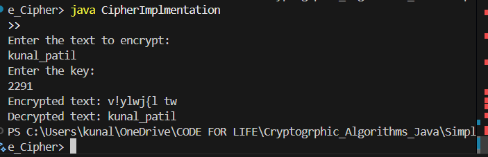
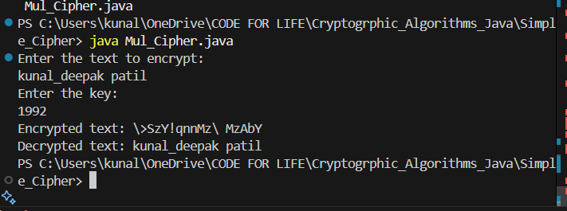

# Simple Cipher Implementations

This project implements two basic types of substitution ciphers:
1. Additive (Caesar) Cipher
2. Multiplicative Cipher

## Additive Cipher

### Overview
The Additive Cipher (also known as Caesar Cipher) shifts each character in the plaintext by a fixed number of positions (the key) in the ASCII range.

### Implementation Details
- ASCII Range: 32 (space) to 126 (~)
- Total Characters: 95
- Encryption: `C = (P + K) mod 95`
- Decryption: `P = (C - K) mod 95`

Where:
- C = Ciphertext character
- P = Plaintext character
- K = Key

### Example Usage
```
Enter the text to encrypt: 
Hello World!
Enter the key: 
5
Encrypted text: Mjqqt%\twqi&
Decrypted text: Hello World!
```

## Multiplicative Cipher

### Overview
The Multiplicative Cipher multiplies each character's position by the key and takes modulo with the range.

### Implementation Details
- ASCII Range: Same as Additive Cipher (32-126)
- Encryption: `C = ((P - 32) × K) mod 95 + 32`
- Decryption: `P = ((C - 32) × K⁻¹) mod 95 + 32`

Where K⁻¹ is the modular multiplicative inverse of K.

### Important Note
The key must be coprime with 95 (the range) for the cipher to work properly. Valid keys include: 3, 7, 11, 13, 17, 19, 23, 29, 31, 37, 41, etc.

### Example Usage
```
Enter the text to encrypt: 
Hello World!
Enter the key: 
7
Encrypted text: *M))=I/=@)N
Decrypted text: Hello World!
```

## Security Considerations
- Both ciphers are basic substitution ciphers and are not secure for modern cryptographic purposes
- They are vulnerable to:
  1. Brute force attacks (small key space)
  2. Frequency analysis
  3. Known plaintext attacks

## Implementation Files
1. `CipherImplmentation.java` - Contains the Additive Cipher implementation
2. `Mul_Cipher.java` - Contains the Multiplicative Cipher implementation

## How to Run
1. Compile both files:
```bash
javac CipherImplmentation.java
javac Mul_Cipher.java
```

2. Run either implementation:
```bash
java CipherImplmentation  # For Additive Cipher
java Mul_Cipher          # For Multiplicative Cipher
```

## Mathematical Background

### Modular Multiplicative Inverse
For the multiplicative cipher, we need to find the modular multiplicative inverse of the key for decryption. A number K has a multiplicative inverse modulo N if:

(K × X) mod N = 1

For example, if K = 3 and N = 7:
- 3 × 5 mod 7 = 1
- Therefore, 5 is the multiplicative inverse of 3 modulo 7
```

</file>

Note: For actual images of the output, you would need to:
1. Run both implementations with various inputs
2. Take screenshots of the terminal output
3. Save them in an `images` folder
4. Add them to the README using markdown image syntax like:
```markdown


```

You can enhance this README further by:
1. Adding more examples
2. Including implementation-specific details
3. Adding performance considerations
4. Including test cases
5. Adding error handling examples